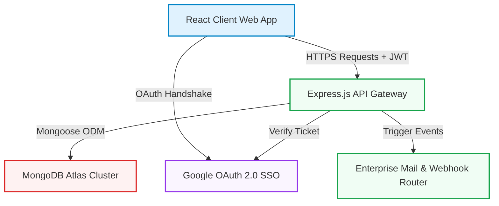
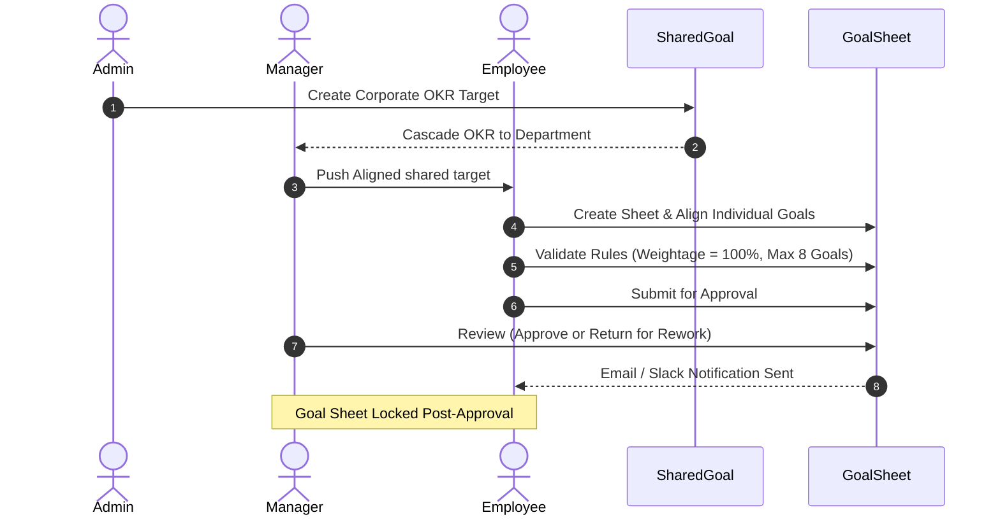
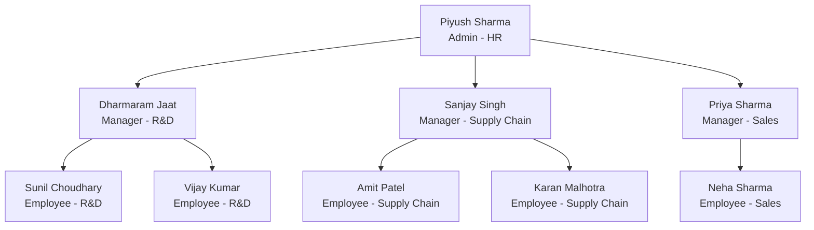

# 🌀 AtomQuest 1.0 — Enterprise Goal-Cascading & Performance Portal

[](https://atomberg.com/)
[](https://react.dev/)
[](https://nodejs.org/)
[](https://www.mongodb.com/)
[](https://console.cloud.google.com/)

An elite, production-grade Performance Management System (PMS) custom-engineered for **Atomberg Technologies** for the **Atomberg Hackathon 1.0**. AtomQuest bridges the gap between top-level corporate strategy and ground-level execution using a secure, responsive, and visually stunning web platform.

---

## 🗺️ Live Demo & Repository
*   **Production Web Portal**: `https://atomberg-web-portal.vercel.app`
*   **Production API Service**: `https://atomberg-web-portal.onrender.com`
*   **Source Code Repository**: `https://github.com/u24ai063sunil/AtomBerg_Web_Portal.git`

---

## 🏛️ System Architecture

AtomQuest is designed on a resilient, decoupled MERN architecture backed by enterprise-grade validation, secure JWT sessions, and real-time cascaded goal calculations.



### 🔄 End-to-End Goal Cascade Flow



---

## ✨ Features Spotlight

### 1. 🎯 Dynamic Goal Creation & Strict Rule Validation
*   **Intelligent Validation Engine**: Automatically enforces that the total goal weightage equals exactly **100%**, allows a maximum of **8 goals** per cycle, and sets a minimum weightage of **10%** per goal.
*   **Diverse UoM Support**: Supports Numeric, Percentage (%), Milestone-based, and Zero-based target metrics with customized computation logic for each.

### 2. 👨‍💼 Rigorous Governance & Approval Workflows
*   **Sheet Locking**: Goal sheets are locked instantly upon approval to ensure absolute audit integrity.
*   **Stateful Iteration**: Supports "Return for Rework" workflow with live status indicators and real-time manager feedback comments.
*   **KPI Cascading (Shared Goals)**: Admins and Managers can push parent objectives that propagate down to employee goal sheets.

### 3. 📈 Continuous Performance Tracking & Check-ins
*   **Quarterly Window Enforcement**: Enforces designated periods (Q1, Q2, Q3, Q4) for tracking check-ins.
*   **Planned vs. Actual Timeline Tracking**: Visual, comparative metrics showing the path toward goal completion.
*   **Leaderboards & Peer Kudos Feed**: Active peer recognitions wall where employees praise colleagues under various company thrust areas.

### 4. 👑 Enterprise Governance (Admin Dashboard)
*   **Organization Analytics**: Comprehensive charts mapping submission status, target completion rates, and department performance.
*   **Immutable Audit Trail**: Transparent log tracking all exceptions, role switches, and administrative updates.

---

## 🔑 Demo Walkthrough Credentials
To facilitate immediate testing, the database has been seeded with standard mock employee records. 

> [!NOTE]
> All password credentials are set to **`Atomberg123!`**. You can also sign in securely with **Google SSO** using the emails listed below.

### 👥 Seeding Hierarchy Overview



### 🔐 Active Login Credentials
*   **Demo User (ADMIN)**: `d03025346@gmail.com` | Password: `Atomberg123!` *(Your Google account)*
*   **HR Admin**: `admin@atomberg.com` | Password: `Atomberg123!`
*   **R&D Manager**: `dharmaram@atomberg.com` | Password: `Atomberg123!`
*   **Senior Design Engineer (Employee)**: `sunil@atomberg.com` | Password: `Atomberg123!`

---

## 🛠️ Step-by-Step Installation Guide

### Prerequisites
*   Node.js (v18.x or above)
*   MongoDB Cluster (Local or Atlas)
*   Google Developer Console Account (for SSO Client IDs)

### 1. Repository Setup
```bash
git clone https://github.com/u24ai063sunil/AtomBerg_Web_Portal.git
cd AtomBerg_Web_Portal
```

### 2. Backend Installation & Environment Config
Navigate to the backend directory and install dependencies:
```bash
cd backend
npm install
```

Create a `.env` file inside `/backend` with the following variables:
```env
PORT=5000
MONGODB_URI=your_mongodb_atlas_connection_string
JWT_SECRET=your_secure_jwt_secret_token
GOOGLE_CLIENT_ID=your_google_oauth_client_id
GOOGLE_CLIENT_SECRET=your_google_oauth_client_secret
CALLBACK_URL=http://localhost:5000/auth/google/callback
FRONTEND_URL=http://localhost:5173
EMAIL_SERVICE=gmail
EMAIL_USER=your_email@gmail.com
EMAIL_PASS=your_app_specific_password
SLACK_WEBHOOK_URL=your_slack_webhook_channel_url
```

#### 🌱 Seed the Database Instantly
To immediately populate the entire corporate structure, cascades, check-ins, kudos, and badges, run:
```bash
node utils/seedData.js
```

Start the backend API server:
```bash
npm start
```

### 3. Frontend Installation & Start
Open a new terminal session, navigate to the frontend directory, and install dependencies:
```bash
cd ../frontend
npm install
```

Start the local Vite development server:
```bash
npm run dev
```

Visit `http://localhost:5173` to explore the AtomQuest dashboard!

---

## 🏆 Hackathon Submission Deliverables Check
1.  **Hosted Web App Link**: Provided in submission sheet.
2.  **Clean Repository Link**: Included and version-controlled.
3.  **Architecture PDF**: Generated via `SUBMISSION.pdf`.
4.  **Three-Role Complete Journeys**: Detailed inside the official [implementation.md](file:///d:/Atomberg_WebPortal/implementation.md) file.

---
*Developed with ❤️ for Atomberg Technologies Hackathon 1.0.*
