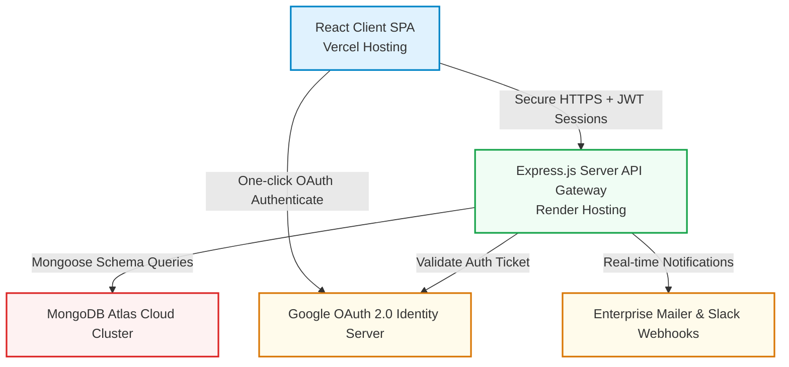

# 🌀 AtomQuest 1.0 — Official Hackathon Submission Dossier

**Submitted For**: Atomberg Technologies Hackathon 1.0  
**Project Name**: AtomQuest 1.0 — Goal-Cascading & Performance Tracking Portal  
**Author / Team**: Sunil Choudhary & Team  

---

## 🔗 Official Project Resources
*   **Live Web Portal URL**: `https://atomberg-web-portal.vercel.app`
*   **Production API Server URL**: `https://atomberg-web-portal.onrender.com`
*   **GitHub Repository URL**: `https://github.com/u24ai063sunil/AtomBerg_Web_Portal.git`

---

## 🔑 Demonstration Credentials
To facilitate immediate evaluation, the live database is fully populated with comprehensive corporate hierarchies, approved sheets, and achievements.

> **General Password**: **`Atomberg123!`** (Applies to all seeded accounts).

| Role | Email | Password | Name / Designation |
| :--- | :--- | :--- | :--- |
| **Demo User (ADMIN)** | `d03025346@gmail.com` | `Atomberg123!` | Demo User *(External Auditor)* |
| **Manager** | `dharmaram@atomberg.com` | `Atomberg123!` | Dharmaram Jaat *(Director of R&D)* |
| **Employee** | `sunil@atomberg.com` | `Atomberg123!` | Sunil Choudhary *(Sr. Motor Design Engineer)* |

*(You may also log in with one-click via Google Sign-In using your Google account: `d03025346@gmail.com`)*.

---

## 🏗️ Technical Architecture Diagram

---

## 🛣️ Step-by-Step User Journey Test Walkthroughs
Please follow these steps to experience the full end-to-end cascading, check-in, and feedback workflows:

### 👤 Journey 1: The Employee (Sunil Choudhary)
1.  Navigate to the web portal and sign in as `sunil@atomberg.com`.
2.  **Dashboard Overview**: View your progress scorecard, target metrics compared on timelines, and continuous coworker kudos praise feed.
3.  **Goal Sheets Workspace**:
    *   Observe that your **Q1 Goal Sheet** is already **APPROVED & LOCKED** to ensure absolute data governance.
    *   Click **Check-ins**: Access your individual goals (such as **ANSYS Core Thermal Modeling** aligned to corporate targets).
    *   Update a check-in: Log a new quarterly achievement entry (Planned vs. Actual value with a score). See the completion percentage automatically calculate!
4.  **Kudos Wall Feed**: Go to the Dashboard and post a praise card thanking your manager or teammate Vijay for outstanding support under the **BLDC Tech** thrust area.

---

### 👤 Journey 2: The Manager (Dharmaram Jaat)
1.  Sign out and sign in using `dharmaram@atomberg.com`.
2.  **Manager's Hub**:
    *   Click **My Team** to see your direct reportees: **Sunil Choudhary** and **Vijay Kumar**.
    *   Check their goal completion rates and access their approved sheets.
3.  **Review Check-ins & Track Metrics**:
    *   Review Sunil's recent check-in values and leave structured feedback comments to guide their next sprint.
4.  **Shared KPIs Cascade**:
    *   Go to **Shared Goals** and view **Reduce BLDC Motor Core Losses** pushed from Admin. 
    *   Push/Cascade this departmental target down to a reportee's active goal sheet.

---

### 👤 Journey 3: The HR Admin (Piyush Sharma or Demo User)
1.  Sign out and sign in using `d03025346@gmail.com` *(or `admin@atomberg.com`)*.
2.  **Governance Dashboard**:
    *   View real-time organizational analytics, cycle stats, and department performance heatmaps.
3.  **Cycle & User Administration**:
    *   Configure active goal alignment cycles.
    *   Access the **User Directory** to dynamically assign managers, adjust role clearances (Employee / Manager / Admin), or toggle active employee statuses.
4.  **Immutable Audit Trails Log**:
    *   Visit **Audit Logs** to view the absolute, transparent chronological log of all administrative actions, workflow approvals, and status overrides in the portal.

---

### 🏁 Instructions for Submission
1.  **Open this document** in your markdown editor.
2.  **Insert your actual Vercel & Render URLs** in the placeholders at the top.
3.  **Convert to PDF**: In VSCode, press `Ctrl+Shift+P`, type `Markdown: Export PDF`, or paste the text into a Word document and save as a PDF.
4.  **Upload the single PDF file** directly to the hackathon submission portal!

*Thank you for evaluating AtomQuest 1.0!*
