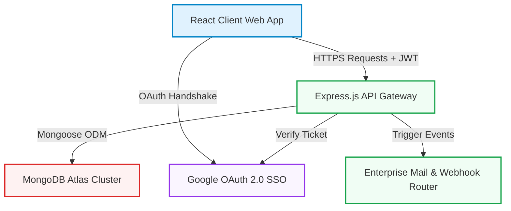
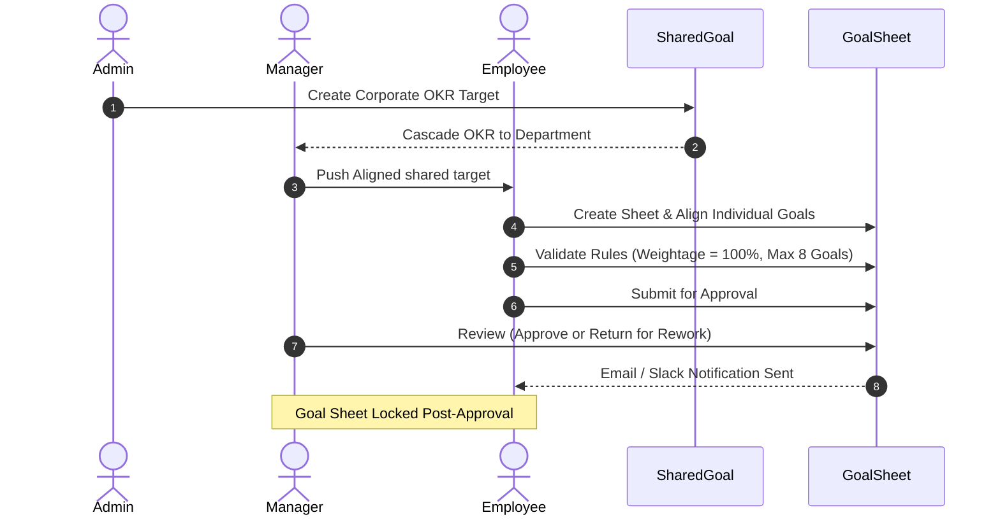

# 🌀 AtomQuest 1.0 — Official Hackathon Submission Dossier

**Submitted For**: Atomberg Technologies Hackathon 1.0  
**Project Name**: AtomQuest 1.0 — Goal-Cascading & Performance Tracking Portal  
**Author / Team**: Sunil Choudhary & Team  

---

## 🔗 Official Project Resources
*   **Live Web Portal URL**: `https://atomberg-web-portal.vercel.app`
*   **Production API Server URL**: `https://atomberg-web-portal.onrender.com`
*   **GitHub Repository URL**: `https://github.com/u24ai063sunil/AtomBerg_Web_Portal.git`

---

## 🔑 Demonstration Credentials
To facilitate immediate evaluation, the live database is fully populated with comprehensive corporate hierarchies, approved sheets, and achievements.

> **General Password**: **`Atomberg123!`** (Applies to all seeded accounts).

| Role | Email | Password | Name / Designation |
| :--- | :--- | :--- | :--- |
| **Demo User (ADMIN)** | `d03025346@gmail.com` | `Atomberg123!` | Demo User *(External Auditor)* |
| **Manager** | `dharmaram@atomberg.com` | `Atomberg123!` | Dharmaram Jaat *(Director of R&D)* |
| **Employee** | `sunil@atomberg.com` | `Atomberg123!` | Sunil Choudhary *(Sr. Motor Design Engineer)* |

*(You may also log in with one-click via Google Sign-In using your Google account: `d03025346@gmail.com`)*.

---

## 🏗️ Technical Architecture Diagram

AtomQuest is designed on a resilient, decoupled MERN architecture backed by enterprise-grade validation, secure JWT sessions, and real-time cascaded goal calculations.



### 🔍 Architectural Layer & Data Flow Breakdown

#### **1. Client-Side Presentation Layer (Vite + React SPA — Hosted on Vercel)**
*   **Modular Component Architecture**: Decoupled, reusable components (e.g., glassmorphic cards, sidebar layouts) integrated with **Lucide Icons** and styled using **Vanilla CSS Variables** to guarantee low asset bundle footprints and pixel-perfect design consistency.
*   **State & Session Governance**: Leverages the **React Context API** (`AuthContext`) to maintain unified state, handle secure login sessions, and dynamically enforce frontend route-guarding based on active user roles (Employee, Manager, Admin).
*   **Production Hosting**: Optimized statically and deployed to **Vercel** with clean route fallbacks (`vercel.json`) to prevent Single Page Application (SPA) reload 404 errors.

#### **2. API Gateway & Controller Layer (Node.js + Express — Hosted on Render)**
*   **Stateless REST Endpoints**: Routes requests securely using an organized Controller-Service pattern, protected by authentication and RBAC middleware.
*   **Decoupled Dual Authentication**: Intercepts credentials using a secure **JSON Web Token (JWT)** session pipeline, while allowing one-click **Google OAuth 2.0 Single Sign-On (SSO)** for corporate authentication compliance.
*   **Automated Audit Logging**: Dynamic pre-routing middleware automatically intercepts administrative modifications, logging exception triggers and status alterations to an immutable database collection.

#### **3. Database & Storage Layer (MongoDB Atlas Cluster)**
*   **Structured Schemas & Relations**: Utilizes **Mongoose ODM** to enforce validation parameters, dynamic relation population (e.g., direct reportees referencing their active manager), and complex nested objects (e.g., employee gamification badge cabinets).
*   **Optimized Indexing**: Employs unique sparse compound indexes (e.g., ensuring a goal cannot have duplicate quarterly entries per cycle) to guarantee data integrity under high concurrent loads.

#### **4. External Services & Alert Integrations**
*   **Transactional HTTPS & SMTP Mailing**: Integrated with **Resend** (via HTTPS API) to bypass outgoing SMTP port blockages on cloud environments like Render. Automatically falls back to standard **Nodemailer SMTP** for local developer evaluation.
*   **Resilient Webhook Hub**: Asynchronous notifier sending instant corporate updates (e.g., active cycle adjustments or major cascaded targets) to central **Slack channels** to encourage organization-wide transparency.

### 📧 Evaluation of Reliable Email Delivery (Resend Integration)
To bypass the standard outbound SMTP port blockages (ports 25, 465, 587) enforced by hosting environments like Render, the portal now utilizes **Resend**'s secure HTTPS API for email dispatch.

To evaluate this:
1. Obtain an API Key from [Resend](https://resend.com).
2. Add the following environment variable to the backend `.env` or Render dashboard:
   ```env
   RESEND_API_KEY=re_your_api_key
   RESEND_FROM=onboarding@resend.dev   # Or your verified custom domain email
   RESEND_FROM_NAME=AtomQuest          # Optional friendly sender name
   ```
3. When `RESEND_API_KEY` is present, emails will go out instantly via HTTPS.
4. If the key is omitted, the system seamlessly falls back to standard **Nodemailer SMTP** using `EMAIL_USER` and `EMAIL_PASS` (perfect for local development / testing).

---

### 🔄 End-to-End Goal Cascade Flow


---

## 🛣️ Step-by-Step User Journey Test Walkthroughs
Please follow these steps to experience the full end-to-end cascading, check-in, and feedback workflows:

### 👤 Journey 1: The Employee (Sunil Choudhary)
1.  Navigate to the web portal and sign in as `sunil@atomberg.com`.
2.  **Dashboard Overview**: View your progress scorecard, target metrics compared on timelines, and continuous coworker kudos praise feed.
3.  **Goal Sheets Workspace**:
    *   Observe that your **Q1 Goal Sheet** is already **APPROVED & LOCKED** to ensure absolute data governance.
    *   Click **Check-ins**: Access your individual goals (such as **ANSYS Core Thermal Modeling** aligned to corporate targets).
    *   Update a check-in: Log a new quarterly achievement entry (Planned vs. Actual value with a score). See the completion percentage automatically calculate!
4.  **Kudos Wall Feed**: Go to the Dashboard and post a praise card thanking your manager or teammate Vijay for outstanding support under the **BLDC Tech** thrust area.

---

### 👤 Journey 2: The Manager (Dharmaram Jaat)
1.  Sign out and sign in using `dharmaram@atomberg.com`.
2.  **Manager's Hub**:
    *   Click **My Team** to see your direct reportees: **Sunil Choudhary** and **Vijay Kumar**.
    *   Check their goal completion rates and access their approved sheets.
3.  **Review Check-ins & Track Metrics**:
    *   Review Sunil's recent check-in values and leave structured feedback comments to guide their next sprint.
4.  **Shared KPIs Cascade**:
    *   Go to **Shared Goals** and view **Reduce BLDC Motor Core Losses** pushed from Admin. 
    *   Push/Cascade this departmental target down to a reportee's active goal sheet.

---

### 👤 Journey 3: The HR Admin (Piyush Sharma or Demo User)
1.  Sign out and sign in using `d03025346@gmail.com` *(or `admin@atomberg.com`)*.
2.  **Governance Dashboard**:
    *   View real-time organizational analytics, cycle stats, and department performance heatmaps.
3.  **Cycle & User Administration**:
    *   Configure active goal alignment cycles.
    *   Access the **User Directory** to dynamically assign managers, adjust role clearances (Employee / Manager / Admin), or toggle active employee statuses.
4.  **Immutable Audit Trails Log**:
    *   Visit **Audit Logs** to view the absolute, transparent chronological log of all administrative actions, workflow approvals, and status overrides in the portal.

---

*Thank you for evaluating AtomQuest 1.0!*
