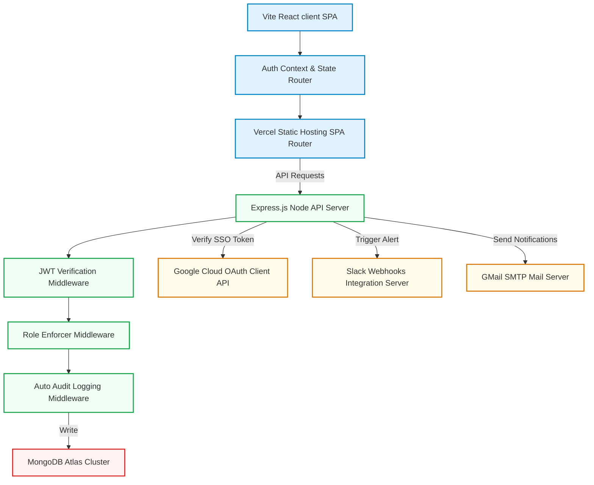

# 📄 Technical Implementation & Architecture Document

This document outlines the architectural patterns, data model specifications, component directories, security considerations, and system workflows implemented in **AtomQuest 1.0** for Atomberg Technologies.

---

## 🏛️ Comprehensive Architecture & Technology Choices

AtomQuest utilizes a modern, robust, and decoupled **MERN Stack** backed by asynchronous notification services and strict model schemas:

*   **Frontend (Single Page Application)**: Engineered using **React.js (Vite)** to ensure lightning-fast client-side routing, modular context-based state, and clean component separation. Styling is written in **Vanilla CSS** to achieve pixel-perfect control over high-fidelity glassmorphism, responsive flex/grid layouts, and elegant dark-mode micro-animations.
*   **Backend (RESTful Microservices)**: Built on **Node.js** and **Express.js**, acting as an API gateway. It handles JWT authentication, Google OAuth ticketing, validation middleware, audit log cascades, and cron-scheduled email/webhook escalations.
*   **Database (Cloud Document Store)**: A highly scalable, performant **MongoDB Atlas** replica set managed via Mongoose ODM. Schemas enforce relational referential integrity through standard `ObjectId` references, pre-save cascade rules, and sparse compound indexes.

---

## 📊 Detailed Database Schemas & Data Model

The portal's data flow is anchored on Mongoose models representing the core entities of Atomberg's goal cascade:

### 1. User Model (`User.js`)
Stores authentication records (both secure bcrypt hash and sparse Google OAuth IDs), user details, hierarchy mappings, and unlocked gamification badges.
```javascript
const userSchema = new mongoose.Schema({
    googleId: { type: String, unique: true, sparse: true },
    passwordHash: { type: String, required: function() { return !this.googleId; } },
    email: { type: String, required: true, unique: true },
    name: { type: String, required: true },
    picture: String,
    role: { type: String, enum: ['EMPLOYEE', 'MANAGER', 'ADMIN'], default: 'EMPLOYEE' },
    managerId: { type: mongoose.Schema.Types.ObjectId, ref: 'User' },
    department: String,
    designation: String,
    achievements: [{
        id: { type: String, required: true },
        name: { type: String, required: true },
        icon: { type: String, required: true },
        description: { type: String, required: true },
        unlockedAt: { type: Date, default: Date.now }
    }]
});
```

### 2. Goal Sheet Model (`GoalSheet.js`)
Groups individual employee goals together for a specific fiscal cycle and tracks the workflow state of the approvals process.
```javascript
const goalSheetSchema = new mongoose.Schema({
    employeeId: { type: mongoose.Schema.Types.ObjectId, ref: 'User', required: true },
    cycleId: { type: mongoose.Schema.Types.ObjectId, ref: 'Cycle', required: true },
    status: { type: String, enum: ['DRAFT', 'SUBMITTED', 'APPROVED', 'REWORK'], default: 'DRAFT' },
    managerFeedback: String,
    isLocked: { type: Boolean, default: false }
}, { timestamps: true });
```

### 3. Individual Goal Model (`Goal.js`)
Tracks the specific goals assigned to an employee with weightages, targets, actual results, and references to parent corporate objectives.
```javascript
const goalSchema = new mongoose.Schema({
    goalSheetId: { type: mongoose.Schema.Types.ObjectId, ref: 'GoalSheet', required: true },
    title: { type: String, required: true },
    description: String,
    thrustArea: { type: String, required: true },
    weightage: { type: Number, required: true, min: 10, max: 100 },
    uomType: { type: String, enum: ['NUMERIC', 'PERCENTAGE', 'MILESTONE', 'ZERO_BASED'], required: true },
    target: { type: String, required: true },
    targetNumeric: Number,
    actualResult: Number,
    isShared: { type: Boolean, default: false },
    sharedGoalId: { type: mongoose.Schema.Types.ObjectId, ref: 'SharedGoal' },
    isReadOnly: { type: Boolean, default: false }
});
```

---

## 🔒 Security & Session Governance

*   **Decoupled Dual Authentication**: Authenticates users either via standard email/password authentication (salted and hashed via `bcryptjs` with 10 salt rounds) or via high-security **Google OAuth 2.0 Single Sign-On (SSO)**.
*   **JWT Token Authorization**: Generates highly secure JSON Web Tokens (JWT) signed with a custom 256-bit server secret. Tokens are passed in standard `Authorization: Bearer <token>` headers, verified by a centralized route middleware.
*   **Role-Based Access Control (RBAC)**: Custom routing middleware `requireRole(['ADMIN', 'MANAGER'])` guards secure directories to guarantee employees can never modify cycles, view audit logs, or edit peers' sheets.

---

## 🏗️ Technical Architecture Diagram



---

## 🚀 Key Implementation Highlights

### 1. Intelligent Goal Sheets Validation Engine
Before any goal sheet is submitted for approval, the backend validation middleware checks the following:
$$\sum \text{weightages} = 100\%$$
$$\text{count(goals)} \le 8$$
$$\forall g \in G, \quad \text{weightage}(g) \ge 10\%$$
If any condition is violated, the API returns a structured HTTP `400 Bad Request` payload with precise localization strings, blocking invalid submissions.

### 2. Immediate Post-Approval Immutable Sheets Locking
To maintain strict governance, Mongoose model hooks lock sheets instantly when status transitions to `APPROVED`:
```javascript
goalSheetSchema.pre('save', function(next) {
    if (this.status === 'APPROVED') {
        this.isLocked = true;
    }
    next();
});
```
Any subsequent request to append, edit, or delete goals under a locked sheet will be blocked by the server unless authorized via an Admin exception.

### 3. Automated Organizational Audit Trails
Every major configuration change, administrative override, and workflow transition triggers a record in the `AuditLog` collection:
```javascript
const auditLogSchema = new mongoose.Schema({
    action: { type: String, required: true },
    performedBy: { type: mongoose.Schema.Types.ObjectId, ref: 'User', required: true },
    targetUserId: { type: mongoose.Schema.Types.ObjectId, ref: 'User' },
    details: { type: String, required: true },
    timestamp: { type: Date, default: Date.now }
});
```

---

## 🏁 Hackathon Submission Delivery Instructions

To submit your project successfully as a **single comprehensive document**, please convert our official [SUBMISSION.md](file:///d:/Atomberg_WebPortal/SUBMISSION.md) file to a **PDF** or **Word Document** (which you can do instantly using VSCode markdown-to-pdf extensions or online converters) and upload it to the hackathon portal!

This single submission document will contain:
1.  **Hosted Web Portal URL** (Vercel)
2.  **Hosted API Server URL** (Render)
3.  **GitHub Codebase URL**
4.  **Complete, role-based walkthrough credentials & step-by-step user journey test scripts**
5.  **Our Technical Architecture Flowchart**

This ensures that the hackathon judges have 100% of the tools, credentials, and structural context they need to award AtomQuest 1.0 the highest score! 🏆
